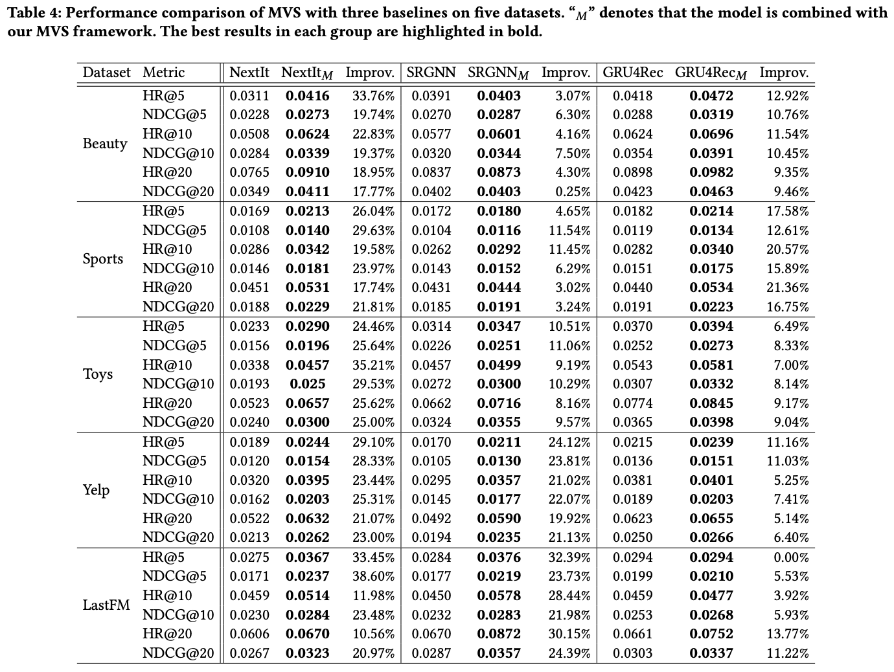

### Experimental Results with Full-Ranking Evaluation Setting}

To comprehensively evaluate our proposed multi-view smoothness framework, we further conduct another group experiments by ranking the ground truth item over the whole item set following[1, 2, 3]. We employ top-k Hit Ratio (HR@k) and top-k Normalized Discounted Cumulative Gain (NDCG@k) with k chosen from {5, 10, 20} to evaluate the performance.

The results are shown in the Table. It is clear to see a significant improvement in all the metrics on the three baseline models, which indicates that our approach can further boost performance of models with different architectures.

#### Reference
[1] Ziwei Fan, Zhiwei Liu, Jiawei Zhang, Yun Xiong, Lei Zheng, and Philip S. Yu. 2021.   Continuous-Time Sequential Recommendation with Temporal Graph Collaborative Transformer. CoRR abs/2108.06625 (2021).
[2] Walid Krichene and Steffen Rendle. 2020. On Sampled Metrics for Item Recom-mendation. InKDD 2020. ACM, 1748–1757.
[3] Ruihong Qiu, Zi Huang, and Hongzhi Yin. 2021.  Memory Augmented Multi-Instance Contrastive Predictive Coding for Sequential Recommendation. CoRR abs/2109.00368 (2021).
